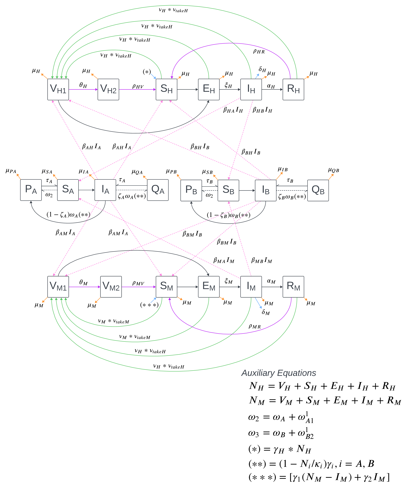

\

#### Model Assumptions:

1.    All human/mammalian births are susceptible; no conferred immunity.

2.    No testing before vaccination; all exposure categories vaccinated at same rate.

3.    Vaccinating exposed humans/mammals prevents conversion to infection.

4.    Waning immunity from recovery and vaccination.

5.    Adjusted birth rate for mammalian host assumes differential births due to maternal infection.

6.    Vector hatch rate is asssumed to be independent of disease status.

\

#### This diagram implies a set of 20 ODEs:

_**Human Host**_, all of the general form "change in disease status over time equals births/deaths $\pm$ disease progression $\pm$ waning immunity $\pm$ vaccination":

\

\begin{equation} \label{eq1}
\begin{split}
\frac{dV_{H1}}{dt} & = - \mu_H V_{H1} + \nu_H*\nu_{takeH} (S_H + E_H + I_H + R_H) - \theta_H \\
\frac{dV_{H2}}{dt} & = - \mu_H V_{H2} + \theta_H - \rho_{HV} V_H \\
\frac{dS_H}{dt} & = - \mu_H S_H + \gamma_H N_H - S_H(\beta_{AH}I_A + \beta_{BH}I_B) + \rho_{HV} V_H + \rho_{HR} V_H - \nu_H*\nu_{takeH} S_H \\
\frac{dE_H}{dt} & = - \mu_H E_H + S_H(\beta_{AH}I_A + \beta_{BH}I_B) - \xi_H E_H - \nu_H*\nu_{takeH} E_H \\
\frac{dI_H}{dt} & = - \mu_H I_H - \delta_H I_H + \xi_H E_H - \alpha_H I_H - \nu_H*\nu_{takeH} I_H \\
\frac{dR_H}{dt} & = - \mu_H R_H + \alpha_H I_H - \rho_{HR} V_H - \nu_H*\nu_{takeH} R_H

\end{split}
\end{equation}

\

_**Mammalian Host**_, identical to human host equations except for birth rate of (*) = $[\gamma_1(N_M - I_M) + \gamma_2 I_M]$, which implies a differing birth rate in infected mothers not captured by disease-specific mortality and "corrected for population density to simulate removal (sales) (Sumaye 2019). Equations are of the general form "change in disease status over time equals births/deaths $\pm$ disease progression $\pm$ waning immunity $\pm$ vaccination":

\

\begin{equation} \label{eq2}
\begin{split}
\frac{dV_{M1}}{dt} & = - \mu_M V_{M1} + \nu_M*\nu_{takeM} (S_M + E_M + I_M + R_M) - \theta_M V_{M1}\\
\frac{dV_{M2}}{dt} & = -\mu_M V_{M2} + \theta_M V_{M1} - \rho_{MV} V_{M2}UBuffs
\\
\frac{dS_M}{dt} & = - \mu_M S_M + [\gamma_1(N_M - I_M) + \gamma_2 I_M] - S_M(\beta_{AM}I_A + \beta_{BM}I_B) + \rho_{MV} V_M + \rho_{MR} V_M - \nu_M*\nu_{takeM} S_M \\
\frac{dE_M}{dt} & = - \mu_M E_M + S_M(\beta_{AM}I_A + \beta_{BM}I_B) - \xi_M E_H - \nu_M*\nu_{takeM} E_M \\
\frac{dI_M}{dt} & = - \mu_M I_M - \delta_M I_M + \xi_M E_M - \alpha_M I_M - \nu_M*\nu_{takeM} I_M \\
\frac{dR_M}{dt} & = - \mu_M R_M + \alpha_M I_M - \rho_{MR} V_M - \nu_M*\nu_{takeM} R_M

\end{split}
\end{equation}

\

_**Vector A**_, based on Vector A of Sumaye 2019 and of the general form "change in life stage equals births (compartment P - including all births from susceptible vectors + proportion of non-vertical transmission births from infected, compartment Q - proportion of vertical transmission births from infected) - hatches - deaths" and "change in disease status equals hatches - deaths $\pm$ disease dynamics". **NOTE**: Sumaye 2019 did not model host-dependent transmission. Their disease dynamics was fully represented as $\omega_A \beta_A S_A$.

\begin{equation} \label{eq3}
\begin{split}
\frac{dP_A}{dt} & = \gamma_A \displaystyle\left(1 - \frac{N_A}{\kappa_A} \right) \displaystyle\left[(\omega_A + \omega_{A2}^1)S_A + (1-\zeta_A) \omega_A I_A\right] - \tau_A P_A - \mu_{PA}P_A \\
\frac{dQ_A}{dt} & = \zeta_A \omega_A \displaystyle\left(1- \frac{N_A}{\kappa_A}\right) \gamma_A I_A - \tau_A Q_A - \mu_{QA}Q_A \\
\frac{dS_A}{dt} & = \tau_A P_A - \mu_{SA} S_A - \omega_A (\beta_{HA} I_H + \beta_{MA} I_M) S_A\\
\frac{dI_A}{dt} & = \tau_A Q_A - \mu_{IA} I_A + \omega_A (\beta_{HA} I_H + \beta_{MA} I_M) S_A

\end{split}
\end{equation}

\

_**Vector B**_, based on Vector B of Sumaye 2019, which is identical to Vector A except for the possibility of dormant eggs (_**NOTE**: I can't find how they modeled that. Equations look identical to Vector A_). Equations are of the general form "change in life stage equals births (compartment P - including all births from susceptible vectors + proportion of non-vertical transmission births from infected, compartment Q - proportion of vertical transmission births from infected) - hatches - deaths" and "change in disease status equals hatches - deaths $\pm$ disease dynamics". **NOTE**: Sumaye 2019 did not model host-dependent transmission. Their disease dynamics was fully represented as $\omega_B \beta_B S_B$.

\begin{equation} \label{eq4}
\begin{split}
\frac{dP_B}{dt} & = \gamma_B \displaystyle\left(1 - \frac{N_B}{\kappa_B} \right) \displaystyle\left[(\omega_B + \omega_{B2}^1)S_B + (1-\zeta_B) \omega_B I_B\right] - \tau_B P_B - \mu_{PB}P_B \\
\frac{dQ_B}{dt} & = \zeta_B \omega_B \displaystyle\left(1- \frac{N_B}{\kappa_B}\right) \gamma_B I_B - \tau_B Q_B - \mu_{QB}Q_B \\
\frac{dS_B}{dt} & = \tau_B P_B - \mu_{SB} S_B - \omega_B (\beta_{HB} I_H + \beta_{MB} I_M) S_B\\
\frac{dI_B}{dt} & = \tau_B Q_B - \mu_{IB} I_B + \omega_B (\beta_{HB} I_H + \beta_{MB} I_M) S_B

\end{split}
\end{equation}

\
